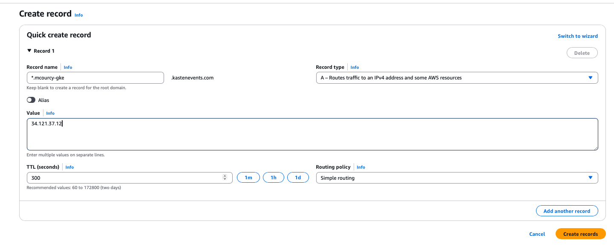

# Goal 

Show how to expose kasten with an Istio ingress

# Install ISTIO

This guide was executed on EKS 1.32.9 and istio 1.28.2
```
Client Version: v1.34.2
Kustomize Version: v5.7.1
Server Version: v1.32.9-eks-3025e55
Warning: version difference between client (1.34) and server (1.32) exceeds the supported minor version skew of +/-1
client version: 1.28.2
control plane version: 1.28.2
data plane version: 1.28.2 (2 proxies)
```

1. Download and install istioctl if you haven't already
```
curl -L https://istio.io/downloadIstio | sh -
cd istio-*
export PATH=$PWD/bin:$PATH
```

2. Make sure your GKE cluster is ready and your kubeconfig is configured

3. Install Istio with the demo profile (adjust as needed), we just want to work with the ingress so we don't install the CNI component
```
istioctl install --set profile=demo --set components.cni.enabled=false -y
```

4. Verify that Istio’s pods are running in the istio-system namespace
```
kubectl get pods -n istio-system
```

# Creating an ingress

Creating an ingress with Istio involves defining an Istio Gateway and a VirtualService. The Gateway resource maps external traffic to the cluster while the VirtualService directs the traffic to the appropriate service. For example, to expose a service called "kasten-service" on port 80, you could use the following YAML definitions:

```yaml
cat <<EOF | kubectl create -f -
apiVersion: networking.istio.io/v1alpha3
kind: Gateway
metadata:
  name: kasten-gateway
  namespace: kasten-io  # This ensures the resource is created in the kasten-io namespace
spec:
  selector:
    istio: ingressgateway  # Use Istio's default ingress gateway
  servers:
  - port:
      number: 80
      name: http
      protocol: HTTP
    hosts:
    - "*"  # Accept traffic for all hosts, or restrict as needed

---
apiVersion: networking.istio.io/v1alpha3
kind: VirtualService
metadata:
  name: kasten-virtualservice
  namespace: kasten-io  # This ensures the resource is created in the kasten-io namespace
spec:
  hosts:
  - "*" # Must match the hosts in the Gateway
  gateways:
  - kasten-gateway
  http:
  - match:
    - uri:
        prefix: /k10
    route:
    - destination:
        host: gateway  # Replace with your actual service name
        port:
          number: 80         # Replace if your service listens on a different port
EOF
```

Find out on which IP your ingressgateway is exposed
```
kubectl get svc -n istio-system
NAME                          TYPE           CLUSTER-IP       EXTERNAL-IP                                                               PORT(S)                                                                      AGE
istio-egressgateway           ClusterIP      10.100.12.213    <none>                                                                    80/TCP,443/TCP                                                               30m
istio-ingressgateway          LoadBalancer   10.100.223.167   a2c5b47b085d44bc9a22504f0519e7a6-1692155039.us-east-1.elb.amazonaws.com   15021:30916/TCP,80:30418/TCP,443:32278/TCP,31400:31625/TCP,15443:31767/TCP   30m
istiod                        ClusterIP      10.100.54.95     <none>                                                                    15010/TCP,15012/TCP,443/TCP,15014/TCP                                        30m
istiod-revision-tag-default   ClusterIP      10.100.204.30    <none>                                                                    15010/TCP,15012/TCP,443/TCP,15014/TCP                                        30m
```

The ingressgateway is exposed on the public IP `a2c5b47b085d44bc9a22504f0519e7a6-1692155039.us-east-1.elb.amazonaws.com`

Use this IP in your browser 
```
http://a2c5b47b085d44bc9a22504f0519e7a6-1692155039.us-east-1.elb.amazonaws.com/k10/
```

# use a domain resolution instead 

Of course this solution is naive, all the request pointing to `34.121.37.12` are now redirected to the gateway kasten-io services.

You want your ingress gateway to handle multiple service. There is plenty way to do it but let's explore a simple solution : **domain resolution**.

I will create a A Record in my DNS provider (In my case it's AWS Route 53) to point to the the IP `34.121.37.12`. For instance for the wilcard domain `*.mcourcy-gke.kastenevents.com`.



Let's check resolution work as expected 

```
dig michael-courcy-is-a-legend.mcourcy-gke.kastenevents.com
...
;; ANSWER SECTION:
michael-courcy-is-a-legend.mcourcy-gke.kastenevents.com. 60 IN A 34.121.37.12
...
```

As you can read the resolution work as expected. 

Now try in your browser 
```
http://michael-courcy-is-a-legend.mcourcy-gke.kastenevents.com/k10/ 
```

And you'll be redirected to Kasten 

But that's not what we want to do we don't want any adress of type `*.mcourcy-gke.kastenevents.com` to expose the kasten gateway we want it to be specific.

For instance `kasten.mcourcy-gke.kastenevents.com`.

```yaml
apiVersion: networking.istio.io/v1alpha3
kind: Gateway
metadata:
  name: kasten-gateway
  namespace: kasten-io  # This ensures the resource is created in the kasten-io namespace
spec:
  selector:
    istio: ingressgateway  # Use Istio's default ingress gateway
  servers:
  - port:
      number: 80
      name: http
      protocol: HTTP
    hosts:
    - "kasten.mcourcy-gke.kastenevents.com"  # Accept traffic for all hosts, or restrict as needed

---
apiVersion: networking.istio.io/v1alpha3
kind: VirtualService
metadata:
  name: kasten-virtualservice
  namespace: kasten-io  # This ensures the resource is created in the kasten-io namespace
spec:
  hosts:
  - "kasten.mcourcy-gke.kastenevents.com" # Must match the hosts in the Gateway
  gateways:
  - kasten-gateway
  http:
  - route:
    - destination:
        host: gateway  # gateway is the service name in kasten-io namespace
        port:
          number: 80   # This should match the port exposed by the service gateway is on 80 in kasten-io
```

let's apply it 
```
kubectl replace -f kasten-ingress-domain.yaml
```

Now it you try to access `http://kasten.mcourcy-gke.kastenevents.com/k10/` it will direct you to the kasten UI but `http://michael-courcy-is-a-legend.mcourcy-gke.kastenevents.com/k10/` will be a 404.

# Use HTTPS instead of HTTP 

Of course we strongly advise that you use a TLS protocol for any services that need to traverse the internet. 

## Install Certmanager and a Let's Encrypt ClusterIssuer 

In order to generate proper certificate generated by let's encrypt we're going to install certmanager and create an issuer that is using let's encrypt.

```bash
   helm install \
     cert-manager jetstack/cert-manager \
     --namespace cert-manager \
     --create-namespace \
     --set installCRDs=true
```

The cluster issuer here is using my email but replace it with your own 

```yaml
apiVersion: cert-manager.io/v1
kind: ClusterIssuer
metadata:
  name: letsencrypt-prod
spec:
  acme:
    server: https://acme-v02.api.letsencrypt.org/directory
    email: michael@kasten.io  # Replace with your email
    privateKeySecretRef:
      name: letsencrypt-prod-key
    solvers:
    - http01:
        ingress:
          class: istio
```

Let's create it 
```
k create -f cluster-issuer.yaml 
```

## Create an https ingress 

You can update your Gateway to listen on port 443 with TLS enabled and reference a Kubernetes secret (generated by cert-manager) for the certificate. For example, first update your Gateway as follows:
```yaml
apiVersion: networking.istio.io/v1alpha3
kind: Gateway
metadata:
  name: kasten-gateway
  namespace: kasten-io
spec:
  selector:
    istio: ingressgateway
  servers:
  - port:
      number: 443
      name: https
      protocol: HTTPS
    tls:
      mode: SIMPLE
      credentialName: kasten-tls  # Name of the secret containing TLS certificate and key
    hosts:
    - "kasten.mcourcy-gke.kastenevents.com"

---
apiVersion: networking.istio.io/v1alpha3
kind: VirtualService
metadata:
  name: kasten-virtualservice
  namespace: kasten-io
spec:
  hosts:
  - "kasten.mcourcy-gke.kastenevents.com"
  gateways:
  - kasten-gateway
  http:
  - route:
    - destination:
        host: gateway
        port:
          number: 80
```

Next, create a cert-manager Certificate (and an Issuer or ClusterIssuer) to automatically obtain a certificate from your chosen CA. For example, if you already have an Issuer named letsencrypt in the same namespace, you can create a Certificate resource like this:

```yaml
apiVersion: cert-manager.io/v1
kind: Certificate
metadata:
  name: kasten-tls
  namespace: kasten-io
spec:
  secretName: kasten-tls
  issuerRef:
    name: letsencrypt-prod
    kind: ClusterIssuer
  commonName: kasten.mcourcy-gke.kastenevents.com
  dnsNames:
  - kasten.mcourcy-gke.kastenevents.com
```

Let' apply it 

```
kubectl replace -f kasten-ingress-domain-tls.yaml
kubectl create -f kasten-certificate.yaml
```

Now you're all good you can access the Kasten UI with `https://kasten.mcourcy-gke.kastenevents.com/k10/`

# Uninstall ISTIO

```
istioctl uninstall --purge -y
```

